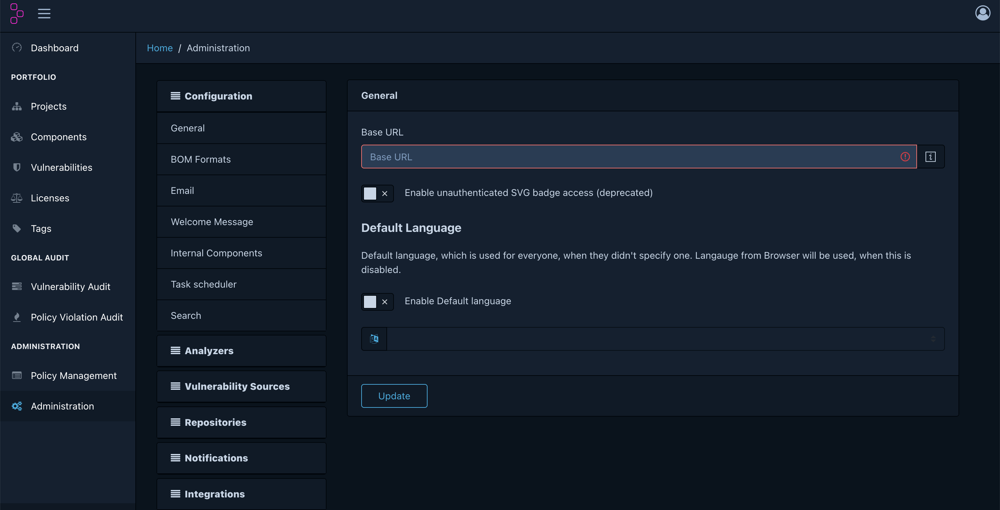
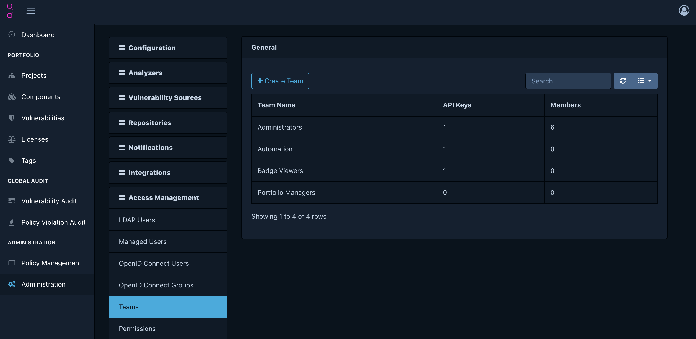
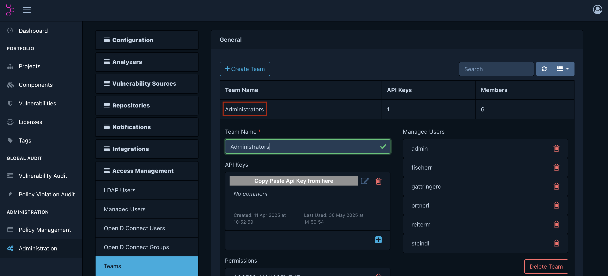

# Automized analysis for "secure java code upgrade"

## Prerequisites:
* ```mvn clean install``` has to result in **BUILD SUCCESS**
  * use normal settings.xml (without private registries)
  * __ATTENTION__ if you haven't installed *mvn* you need to add those two lines below ```#!/bin/bash``` in your ``` autoUpdateAnalyse.sh``` file:
    * ```shopt -s expand_aliases```
    * ```alias mvn='<path to your mvnd.cmd>'```

## Requirements:
* *Windows:* GitBash has to be available
* Permission to download sth. on your machine, in that case it is node (via script) automatically
* Firewall activation towards our dependency track and sonar qube
  * if absolutely not possible docker must be provided for dependency track and the url must be changed *(dependency-track(-mac).sh)*
### Quick check for requirements:
* To make things easier just run this script in the '01-analysis'-folder:
```bash
sh check-env.sh
```
* If everything comes out green then you can continue with the Preparation and Usage.

# Preparation:
* Dependency Track Api Key:
  * If you don't have a dependency track user for our dependency track (https://gepardec-dtrack.apps.cloudscale-lpg-2.appuio.cloud/) please contact [Christoph Ruhsam](mailto:christoph.ruhsam@gepardec.com).
  * If you have one please follow these steps:
    * Navigate to **Administration**:
      
    * Navigate to **Access Management > Teams**:
      
    * Navigate to **Administrators** and copy the **Api Key**:
      
* SonarQube Admin Password:
  * To get the Admin Password please contact [Christoph Ruhsam](mailto:christoph.ruhsam@gepardec.com)

## Usage:
1. Git pull this repository
2. Change directory to '01-analysis'
3. Execute
   * Change to executable
     * ```chmod +x autoUpdateAnalyse.sh ``` or <br>
       ```chmod 777 autoUpdateAnalyse.sh```<br><br>

   * Run it with absolute paths
     ```bash
     # ./autoUpdateAnalyse.sh --project-root <absolute-path-to-project-root>
     ./autoUpdateAnalyse.sh --project-root /home/test/project/test-project/
     ```
     or
     ```bash 
     # sh autoUpdateAnalyse.sh --project-root <absolute-path-to-project-root> --maven-project-root <absolute-path-to-maven-project-root>
     sh autoUpdateAnalyse.sh --project-root /home/test/project/test-project/ --maven-project-root /home/test/project/test-project/maven/
     ```
     
     > **INFO** <br>
     As a default setting cleanup is activated, which deletes all files that are no longer needed. If you want to change it you can extend the command above with **--cleanup false**
   
   * Next you will be asked to put in the "Dependency Track Api Key" and "SonarQube Admin Password", which will be set as environment variables at the beginning and deleted at the end.

## Results:
> **INFO** <br>
    Examples, for all outcomes mentioned below, are provided in the demo-final-reports folder.

A folder **final-reports** will be created, which contains:
* auto-update-report.json,
* *<module-name>* -dependency-analysis.json &
* dependency-track-vulnerability-report.json (this one is already included in auto-update-report.json, it's still here just in case you want to check it)

> **NOTE** <br>
> Json conversion to csv is still in development.
