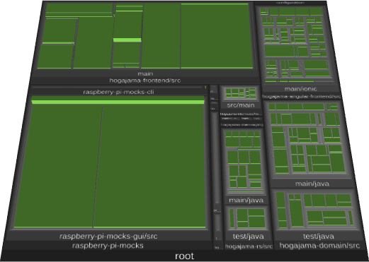

= Analysis Report How-Tos
mattias.fankhauser@gepardec.com
Jul 28, 2025
:toc:
:toc-title: Table of Contents

== Gephi

To visualize dependency connections, Gephi – a Graph Viz platform, is used. Gephi was already evaluated in a dedicated Learning-Friday project, and the https://docs.google.com/document/d/1MoyWDXBLoUBCKmDdNLgmk9D32tICtIeHOxkqoaUaDUE/edit?usp=sharing[beginners documentation] contains all necessary information for creating data, importing, etc. [1].

== CodeCharta

=== Software-Cities Visualization

A Software City represents the source code of an application as a three-dimensional city. The mapping is as follows:

* *Project/codebase* = City
* *Files/classes* = Buildings
* *Directories/modules/packages* = Districts
* *Metrics* such as lines of code, change frequency, and complexity influence the height, area, and color of the buildings.

These visualizations help with:

* Identifying complex or neglected code areas
* Architecture reviews
* Refactoring preparation
* Supporting team communication

=== Local Setup of CodeCharta

==== Requirements

* Node.js (≥ v20) installed
* Git installed

==== Clone repository and start

[source,shell]
----
# Clone our code base
$ git clone https://github.com/MaibornWolff/codecharta.git
# Navigate into the visualization part
$ cd codecharta/visualization
# Install dependencies
$ npm i
# Start the dev server
$ npm run dev
----

The web app is then accessible at http://localhost:3000. Full documentation can be found on the CodeCharta homepage [2].

=== Creating Visualization Data from a Java Project

This how-to is based on the Hogajama project.

==== 1. Prepare the project

Example: The Java project hogajama

[source,shell]
----
git clone https://github.com/Gepardec/Hogarama
cd hogajama
----
The project contains, among other things, Java source code in /src, a pom.xml, resources and typical Maven structure.
==== 2. Install CodeCharta Analyzer CLI

[source,shell]
----
npm install -g codecharta-analysis
----

==== 3. Analyze code

For Java projects, it's recommended to use the CodeCharta CLI tool for analysis [3]:

[source,shell]
----
ccsh unifiedparser <path/to/your/project> java -o hogajama.cc.json
----

This generates a `.cc.json` file containing all relevant metrics of the project.

=== Visualization with CodeCharta

[source,shell]
----
npm run dev
----

Open in browser: http://localhost:3000
Load the file `hogajama.cc.json` via "Import".

Explore interactively:

* Building height: e.g. number of lines
* Color: complexity
* Area: e.g. number of commits (if Git metrics are included)

=== (Optional) Integrate Git History

Generate additional metrics from Git commits:

[source,shell]
----
ccsh git-metrics -p . -o gitmetrics.cc.json
ccsh merge -i hogajama.cc.json gitmetrics.cc.json -o merged.cc.json
----

== Conclusion

Using CodeCharta, the complexity and structure of a Java project can be visualized in a comprehensible way, both in technical discussions and workshops. CodeCharta allows teams to explore hotspots, legacy segments, and architectural patterns with intuitive 3D models. Combined with Git metrics, change frequency and ownership patterns can also be mapped effectively.

Visual exploration can thus serve as the basis for:

* Communication and collaboration in development teams
* Preparing and evaluating refactorings
* Architecture reviews and technical documentation

If desired, I can generate a print-ready document or a Word file from it.

== SonarQube API

This chapter documents the usage of a reusable and executable `.http` file to retrieve complete project information from a SonarQube instance using its official REST API. The described requests cover relevant needs for project analysis needed at the moment. All information has been gathered from the official SonarQube documentation [4].

The file consists of six main API requests:

1. Project Metadata
2. Project Measures (Quality Metrics)
3. Quality Gate Status
4. Issues
5. Analysis History
6. Project Settings

Each section includes inline comments and documentation to describe the request and the metrics it covers.

=== Variable Configuration

Before executing any requests, you must define the following variables at the top of your `.http` file:

[source,http]
----
@sonarHost = http://localhost:9000
@projectKey = hogajama
@authToken = abc1234567890TOKEN
@base64Auth = {{authToken}}: | base64
----

- `@sonarHost`: Base URL of your SonarQube server
- `@projectKey`: Key of the target project in SonarQube
- `@authToken`: Your SonarQube API token
- `@base64Auth`: Base64-encoded version of `<TOKEN>:` used for Basic Auth

'''

=== REST Requests

[source,http]
----
### 1. Project Metadata
# Retrieves metadata for the specified project, such as its name, visibility, and type.
GET {{sonarHost}}/api/components/show?component={{projectKey}}
Authorization: Basic {{base64Auth}}

### 2. Project Measures
# Fetches key quality metrics for the project across all quality domains.
# @metrics
# - alert_status: Quality Gate status (OK / ERROR)
# - bugs: Reliability issues
# - vulnerabilities: Security issues
# - security_hotspots: Code locations needing security review
# - security_hotspots_reviewed: Reviewed hotspots count
# - code_smells: Maintainability issues
# - sqale_rating: Maintainability rating (A–E)
# - sqale_index: Technical debt in minutes
# - sqale_debt_ratio: Technical debt as % of development cost
# - reliability_rating: Reliability rating (A–E)
# - reliability_remediation_effort: Time to fix reliability issues
# - security_rating: Security rating (A–E)
# - security_remediation_effort: Time to fix security issues
# - coverage: Code coverage overall
# - line_coverage: Line-specific test coverage
# - branch_coverage: Branch-specific test coverage
# - tests: Total number of tests
# - test_errors: Tests with errors
# - test_failures: Tests with failures
# - duplicated_lines: Number of duplicated lines
# - duplicated_blocks: Number of duplicated code blocks
# - duplicated_lines_density: % of duplicated code
# - ncloc: Non-comment lines of code
# - lines: Total lines
# - files: Number of files
# - functions: Number of functions
# - classes: Number of classes
# - statements: Number of statements
# - complexity: Cyclomatic complexity
# - cognitive_complexity: Human-perceived complexity
GET {{sonarHost}}/api/measures/component?component={{projectKey}}&metricKeys=alert_status,bugs,vulnerabilities,security_hotspots,security_hotspots_reviewed,code_smells,sqale_rating,sqale_index,sqale_debt_ratio,reliability_rating,reliability_remediation_effort,security_rating,security_remediation_effort,coverage,line_coverage,branch_coverage,tests,test_errors,test_failures,duplicated_lines,duplicated_blocks,duplicated_lines_density,ncloc,lines,files,functions,classes,statements,complexity,cognitive_complexity
Authorization: Basic {{base64Auth}}

### 3. Quality Gate Status
# Returns whether the project passed or failed the configured quality gate, along with details about which conditions were met or violated.
GET {{sonarHost}}/api/qualitygates/project_status?projectKey={{projectKey}}
Authorization: Basic {{base64Auth}}

### 4. Issues (First Page)
# Retrieves the first 500 issues (bugs, vulnerabilities, code smells) for the project.
# Use pagination (p=2,3,...) to fetch additional results.
GET {{sonarHost}}/api/issues/search?componentKeys={{projectKey}}&p=1&ps=500
Authorization: Basic {{base64Auth}}

### 5. Analysis History
# Fetches the scan history of the project, including timestamps and version tags.
GET {{sonarHost}}/api/project_analyses/search?project={{projectKey}}
Authorization: Basic {{base64Auth}}

### 6. Project Settings
# Retrieves project-specific configuration including exclusions, branch settings, and plugin-defined options.
GET {{sonarHost}}/api/settings/values?component={{projectKey}}
Authorization: Basic {{base64Auth}}
----

=== Execution Notes

To run the REST requests, follow these steps:

1. Create a new http file in your preferred HTTP client (e.g., Postman, Insomnia, or any REST client that supports `.http` files).
2. Copy the above code into the file (configuration and requests).
3. Ensure you have the necessary permissions to access the SonarQube API.
4. Replace placeholder variables with your actual values.
5. Execute the wanted requests one by one or all at once, depending on your client capabilities.
6. Review the responses for project metrics, issues, and settings.

== References

[1] Gephi.org, “The Open Graph Viz Platform,” [Online]. Available: https://gephi.org.

[2] MaibornWolff GmbH, “CodeCharta Documentation,” [Online]. Available: https://www.codecharta.dev.

[3] MaibornWolff GmbH, “CodeCharta Analyzer CLI,” [Online]. Available: https://github.com/MaibornWolff/codecharta.

[4] SonarSource, “Metric Definitions - SonarQube Documentation,” SonarSource, 2024. [Online]. Available: https://docs.sonarsource.com/sonarqube/latest/user-guide/metric-definitions/
